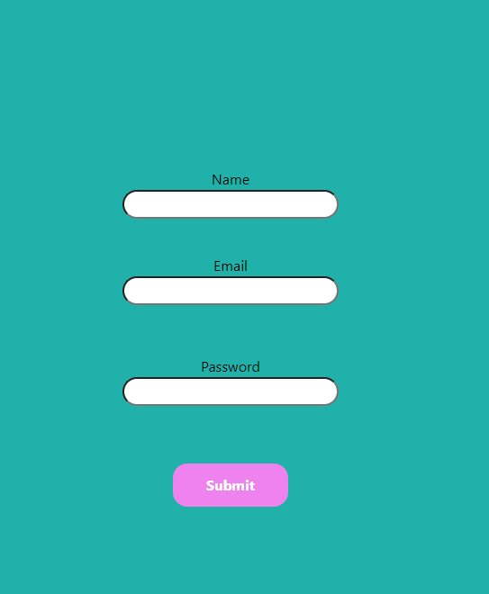

<h1> ## PROYECTO 5, ESTUDIO DE TATUAJES ##</h1>

Este es el quinto proyecto del Bootcamp Full Stack Developer que imparte GeeksHubs Academy. Es el frontend de un sistema e gestión de citas para un estudio de tatuajes.

##Objetivo

-Registro de usuarios.
-Login de usuarios.
-Visualización y gestión de citas por parte de clientes y trabajadores.
-Perfil de usuario.
-Algunas funciones extra solo para superadmin.

## Stack

Este proyecto ha sido desarrollado usando las siguientes tecnologias:

-Rect.
-Redux.
-JavaScript.
-HTML.
-Css.
-Git.
-GitHub.

## Vistas

El proyecto se divide en diferntes vistas. La principal es la vista "Home", es en la que se muestra la galeria de fotografias de los proyectos de los trabajadores.


Despues podemos registrarnos creandonos una cuenta en la pestaña "Register".



Una vez registrados podemos ver nuestro perfil de usuario en la pestaña que aparecerá al registrarnos llamada "Profile".


Dentro de nuestro perfil aparecerán nuestros datos, el nombre, el correo electrónico y el role que desempeñas, y podrás acceder al historial de tus citas dandole al botón que aparece debajo llamado "Citas".


Dentro de tus citas, en la parte de arriba aparecerá un boton llamado "Nueva cita" que usaremos para poder pedir una cita nueva.


Sin estar registrado ni logueado puedes acceder tambien a la pestaña llamada "Workers" donde aparecen todos los trabajadores.


Si quieres desconectarte tendrás que ir al boton del Header donde dice "Log out", así se cerrará tu sesión.

Tambien tenemos la sección de trabajadores, al loguearse un trabajador podemos ver como en el Header aparece que es un trabajador, para poder diferencia si estas logueado como trabajador.


Los trabajadores tambien pueden acceder a su perfil donde aparecen sus datos, y al igual que los usuarios tambien tienen el boton de "Citas" donde pueden acceder a su historial de citas, pero a diferencia de los usuarios, en dicho panel en cada una de las citas no aparecerá el nombre del trabajador, ya que se sobreentiende que todas las citas son suyas.


El superadmin tambien tiene su propio Header, esto quiere decir que cuando te logueas como superadmin en el Header aparece que eres superadmin para diferenciarte de los usuarios y de los trabajadores y aparte aparecen dos pestañas nuevas, una de "Appointments y otra llamada "Users".
En cada una de ellas se puede acceder a un apartado nuevo, en "Appointments" el superadmin puede acceder a todas las citas que existen.


Y en la pestaña "Users" puede acceder a ver a todos los usuarios registrados, con sus datos personales y sus roles, donde indica si son usuarios o trabajadores.


## Mejoras

En un futuro me gustaria poder cambiar todo el diseño del frontend ya que es bastante soso y solo me he enfocado en hacerlo funcional.
Me gustaria tambien el poder añadirle funciones como que el superadmin pudiera borrar usuarios, que los usuarios pudieran modificar su propio perfil.

## Clonar repositorio

1. Clona este repositorio en tu máquina local usando el siguiente comando:

```jsx
 git clone https://github.com/Chichonicle/Proyecto5

```

2. Entra en la carpeta del proyecto.

3. Instala las dependencias:

```bash
 npm install

```

## Backend

Este proyecto depende de un backend para que pueda funcionar completamente bien, para ello debes clonarte tambien el repositorio https://github.com/Chichonicle/Proyecto4
despues de clonartelo deberás seguir las instrucciones del readme tal igual que aqui.

## Agradecimientos

Me gustaria agradecer el apoyo de los compañeros y la ayuda que me han ofrecido, tambien a los profesores del Bootcamp por los conocimientos que me estan otorgando y a mi compañero Pedro, que ha sido quien mas me ha abierto los ojos en este proyecto.
